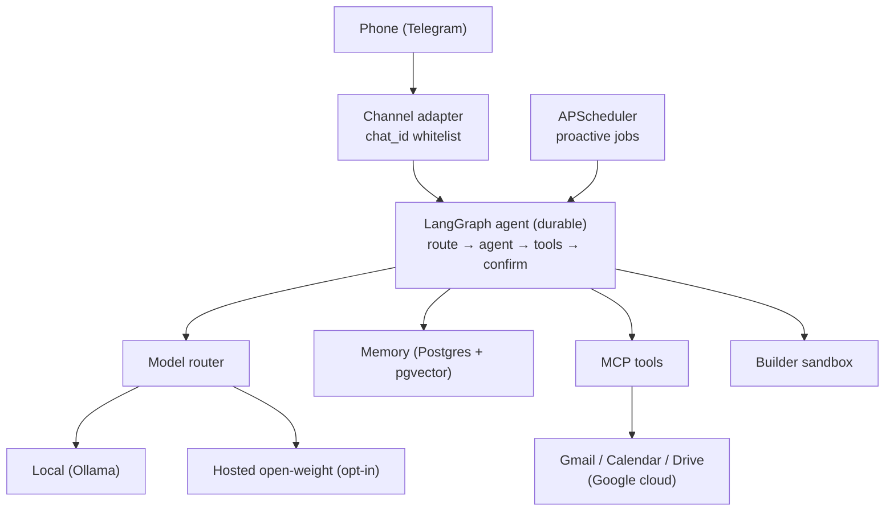
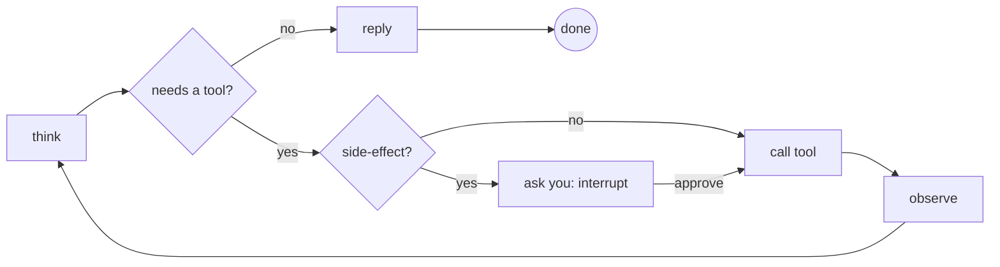
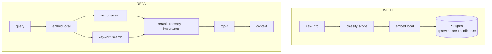
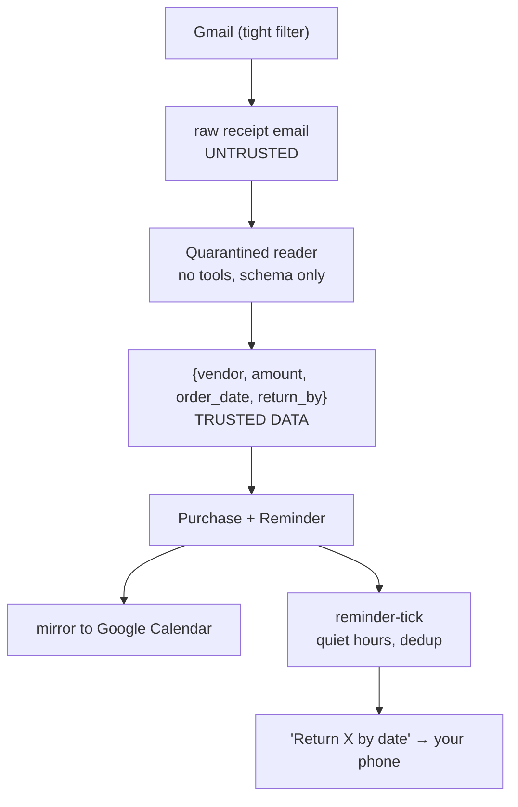
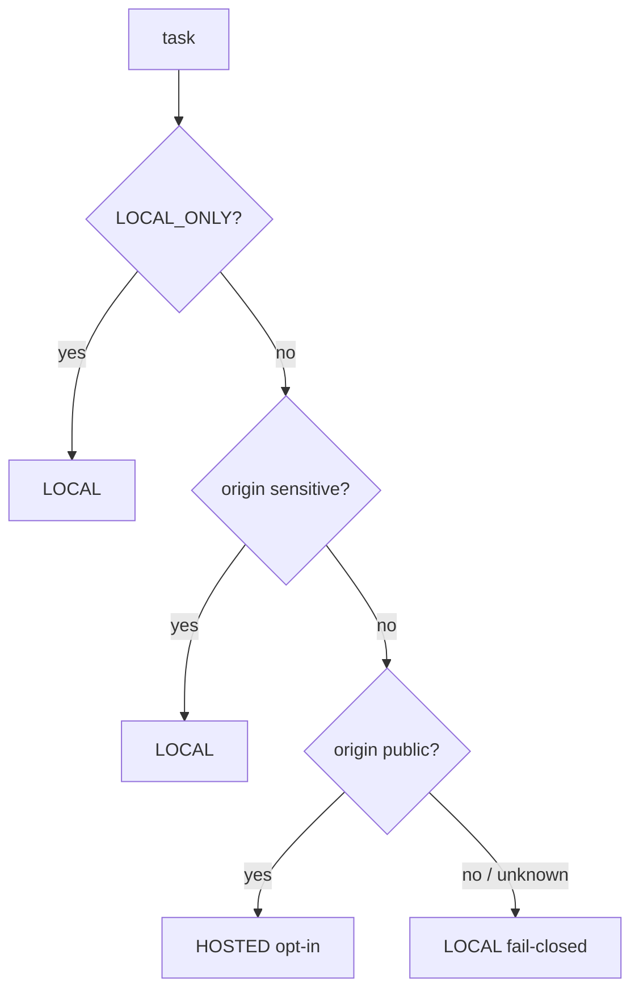

# AI Agent Architectures — A Technical Guide

*The technical companion to `01-primer.md`. Names the specific frameworks, shows code sketches, and diagrams the system. Still written to teach, not to assume expertise — but it goes a level deeper and points at real tools you can look up.*

---

## 0. How to read this doc

Each section covers one architectural layer, names the **real technologies** in that layer (with the ones we chose in **bold**), explains *why* we chose them for a privacy-first personal agent, and where useful shows a minimal code sketch. Diagrams are at the end (§10), in both ASCII and Mermaid.

---

## 1. Agent runtime / orchestration

**The job:** run the think→act→observe loop, hold state, survive restarts, pause for human approval.

**The landscape:**
- **LangGraph** *(chosen)* — models the agent as a stateful graph with a durable checkpointer and first-class `interrupt()` for human-in-the-loop. Best-in-class for *durable, resumable* workflows.
- **Pydantic AI** — elegant and type-safe, but deliberately lean; you'd hand-build durability and HITL.
- **LlamaIndex Workflows** — event-driven; strong if you're RAG-centric.
- **CrewAI / AutoGen** — multi-agent "crews." Powerful but overkill for one user; adds coordination complexity we explicitly skip.
- **Claude Agent SDK / OpenAI Agents SDK** — excellent but tied to frontier hosted models → ruled out on cost + privacy.

**Why LangGraph for us:** a personal agent runs 24/7 with background jobs and *will* restart. LangGraph's Postgres checkpointer means state is persisted after every node, and `interrupt()` lets the graph pause for hours awaiting your Telegram approval without holding a process open.

```python
# Sketch: a minimal graph with a tool node and an approval gate
from langgraph.graph import StateGraph, END
from langgraph.checkpoint.postgres import PostgresSaver

graph = StateGraph(AgentState)
graph.add_node("route", router_node)        # pick local vs hosted model
graph.add_node("agent", agent_node)         # the LLM reasoning step
graph.add_node("tools", tool_node)          # execute a tool call
graph.add_node("confirm", confirm_node)     # interrupt() for side-effects
graph.add_conditional_edges("agent", needs_tool, {"tool": "tools", "done": END})
graph.add_conditional_edges("tools", is_side_effect, {"yes": "confirm", "no": "agent"})

app = graph.compile(checkpointer=PostgresSaver(conn))  # durable state
```

---

## 2. Models & inference

**The job:** the reasoning engine. Must be open-weight (cost + privacy) and good at *function calling* (deciding tool calls).

**Model families:**
- **Qwen 2.5 (7B / 14B / 32B)** *(recommended)* — strong tool-calling, good at its size.
- **Llama 3.1 (8B / 70B)** — solid generalist.
- **DeepSeek / Mistral** — good coders; watch tool-calling reliability.

**Local inference engines:**
- **Ollama** *(chosen)* — easiest OpenAI-compatible local server; `ollama run qwen2.5`.
- **llama.cpp** — the engine under many others; maximal control.
- **MLX** — Apple-Silicon-native; fast on M-series.
- **vLLM** — throughput king, but built for GPU servers, not a Mac.

**Hosted open-weight (for non-sensitive tasks only):**
- **OpenRouter / Together / Groq** — run the *same* open-weight models in the cloud for speed/quality. Groq is extremely fast.

**The key design lever — OpenAI-compatible endpoints everywhere.** Ollama and all three hosted providers speak the OpenAI API shape, so switching local↔hosted is a base-URL swap, not a rewrite:

```python
from langchain_openai import ChatOpenAI
local  = ChatOpenAI(base_url="http://localhost:11434/v1", model="qwen2.5")
hosted = ChatOpenAI(base_url="https://api.groq.com/openai/v1", model="qwen-2.5-32b")
# the router picks one per task — see §4
```

**Hardware reality:** M2/16GB runs a quantized 7–8B model (~5–6GB) tightly alongside Postgres. The Mac mini target (M4 Pro/64GB) holds a 32B-class model — memory *bandwidth* (~273 GB/s vs ~120 GB/s on base M4) is what drives tokens/sec.

---

## 3. Memory system

**The job:** durable, retrievable, three-scope memory that makes the agent personal.

**The landscape:**
- **LangMem** *(chosen)* — LangGraph-native; gives semantic/episodic/procedural scopes and background consolidation.
- **Letta / MemGPT** — pioneered "self-editing memory" + core-block context budgeting; great ideas we borrow.
- **Mem0** — drop-in memory layer; simpler, less integrated with LangGraph.
- **Zep / Graphiti** — temporal *knowledge-graph* memory (entities + relationships over time). Powerful but heavier than one user needs — we take the lightweight version (`valid_from/valid_to/supersedes` columns) instead.

**Vector store options:**
- **pgvector on Postgres** *(chosen)* — one database for relational data + embeddings + the LangGraph checkpointer. Fewer moving parts = ideal at personal scale.
- **Qdrant / Chroma / LanceDB** — dedicated vector DBs; unnecessary when pgvector suffices.

**Embeddings:** **`nomic-embed-text`** run locally via Ollama — *always local, regardless of the model router*, so memory vectors never leave the machine.

**Retrieval is hybrid, not top-k:**

```python
def recall(query, k=8):
    v = embed_local(query)                       # nomic-embed-text
    vec_hits = pg.vector_search(v, limit=30)     # semantic
    kw_hits  = pg.keyword_search(query, limit=30)# exact terms
    merged   = dedupe(vec_hits + kw_hits)
    return rerank(merged, by=["similarity", "recency", "importance"])[:k]
```

Core blocks (persona, current task; <1k tokens) are *always* in context; a summarized working buffer holds the rest.

---

## 4. Privacy-first, sensitivity-aware routing

**The job:** keep private data on-device while still allowing fast/strong hosted models for non-sensitive work.

**The design — deterministic, origin-based, fail-closed:**
- Work is tagged **by where its data came from, in code — not by an LLM's judgment.**
- Anything from Gmail/Calendar/Drive/memory or your personal data → **sensitive → local model + local embeddings only.**
- Generic coding / public info / personal-data-free planning → *non-sensitive* → may use opt-in hosted.
- Unknown origin → **defaults to local** (fails closed).
- A master **`LOCAL_ONLY`** switch forces everything local.

```python
def route(task) -> Endpoint:
    if settings.LOCAL_ONLY:            return LOCAL
    if task.origin in SENSITIVE_SOURCES: return LOCAL   # gmail/cal/drive/memory
    if task.origin in PUBLIC_SOURCES:    return HOSTED  # opt-in
    return LOCAL                        # fail closed
```

**Honest boundary:** the Google MCP servers still call Google's cloud (your mail already lives there). This protects against *new* exposure to third-party *inference* providers — it is not full air-gapping.

---

## 5. Tools & integrations (MCP)

> **Phase 2 update (implemented):** Gmail/Calendar are wired via a **thin direct
> `google-api-python-client` integration**, not MCP — see `docs/06-phase2-build.md`. Why the pivot:
> the placeholder MCP server names below never existed; Google's *official* MCP servers turned out
> to be remote/hosted (not local stdio) and possibly preview-gated; community stdio servers require
> trusting third-party code with your OAuth tokens. Direct API gave the most local, controllable,
> minimal-scope path for this narrow surface. **MCP is still the plan for Phase 7 (Drive)** and
> broader integrations, where its extensibility pays off — the section below stands as that design.

**The job:** connect to Gmail/Calendar/Drive/filesystem without hand-writing glue.

- **MCP (Model Context Protocol)** — open standard; connect off-the-shelf **MCP servers** for Google services.
- **`langchain-mcp-adapters`** *(chosen for Phase 7+)* — loads MCP-server tools as LangGraph tools dynamically.
- **FastMCP** — for writing your *own* MCP server if a service lacks one.

**Least-privilege scopes (enforced by Google, not the prompt):** Gmail `readonly` + `gmail.compose` (drafts) — **never `gmail.send`**. Calendar read/write. This survives prompt injection because the token literally lacks send authority.

```python
from langchain_mcp_adapters.client import MultiServerMCPClient
client = MultiServerMCPClient({
  "gmail":    {"command": "npx", "args": ["-y", "@gmail/mcp"], "transport": "stdio"},
  "calendar": {"command": "npx", "args": ["-y", "@gcal/mcp"], "transport": "stdio"},
})
tools = await client.get_tools()   # become LangGraph tool nodes
```

---

## 6. Security: untrusted content & the control model

**Prompt injection defense — the dual-LLM / CaMeL pattern:**
- A **quarantined reader** model (no tools) parses untrusted email/web/Drive content and emits *only validated structured data*.
- The privileged, tool-wielding agent **never ingests raw untrusted text.**
- Related tooling to look up: **Rebuff**, **NeMo Guardrails**, **Guardrails AI** (guardrail layers); **Instructor / Pydantic / Outlines** (force structured output).

```python
# Quarantined reader: constrained to a schema, no tools registered
class Receipt(BaseModel):
    vendor: str; amount: float; order_date: date; return_by: date | None

receipt = quarantined_llm.with_structured_output(Receipt).invoke(raw_email)
# privileged agent only ever sees `receipt`, never `raw_email`
```

**Control & authority model (layered, so outer layers hold even if the model is hijacked):**
1. Credential scoping (hardest limit — no `gmail.send`).
2. No outbound tools registered by default.
3. Human-in-the-loop `interrupt()` → Telegram Approve/Reject.
4. Recipient/destination allowlist (if send is ever enabled).
5. Kill switches: `/pause`, `/kill`, global `DRY_RUN`.
6. Immutable audit log + daily digest.
7. Rate limits + hard caps + anomaly halt.

---

## 7. Proactivity & scheduling

- **APScheduler** *(chosen)* — background jobs that invoke graph runs (email ingest, reminder-tick, briefings).
- Alternatives at scale: **Temporal / Inngest** (durable workflow engines) — overkill here; LangGraph's checkpointer + APScheduler covers a single user.
- Critical reminders are **mirrored into a real Google Calendar event** so they fire even if the agent is down.

---

## 8. Building / code execution

- Agent-generated code runs in an **isolated workspace** (container or restricted user) with **no access to `data/` secrets or OAuth tokens**.
- Web apps served on localhost + a tunnel (e.g., Cloudflare Tunnel / ngrok) so you can view on your phone.
- Docs via **`python-docx`** and **`reportlab`** / markdown→PDF. Mobile later via **Expo / React Native**.

---

## 9. Evaluation & observability

- **Langfuse** *(recommended)* — self-hostable, privacy-friendly tracing/eval. Keeps traces on your machine.
- **LangSmith** — polished but hosted; **Phoenix (Arize)** — open-source tracing.
- Eval/test frameworks: **Ragas**, **DeepEval**, **AgentDojo** (agent security/injection benchmarking).
- We keep a small, hand-written **eval fixture set** from Phase 1 (recall accuracy, receipt extraction, no-network check) — much lighter than enterprise MLOps, but the safety net for swapping models/code.

---

## 10. Diagrams

### A. Whole-system overview

```
        Phone (Telegram)
              │
              ▼
   ┌─────────────────────┐
   │  Channel adapter     │  chat_id whitelist
   └─────────┬───────────┘
             ▼
   ┌─────────────────────────────────────────────┐
   │            LangGraph agent (durable)          │
   │  route → agent → tools → confirm(interrupt)   │
   └───┬──────────┬───────────┬───────────┬────────┘
       │          │           │           │
       ▼          ▼           ▼           ▼
   ┌───────┐  ┌────────┐  ┌────────┐  ┌─────────┐
   │ Model │  │ Memory │  │  MCP   │  │ Builder │
   │router │  │ pgvec  │  │ tools  │  │ sandbox │
   └──┬─┬──┘  └────────┘  └───┬────┘  └─────────┘
      │ │                     │
   local hosted          Gmail/Cal/Drive
   (Ollama)(opt-in)       (Google cloud)
             ▲
             │
      APScheduler (proactive jobs) ─────────────┘
```



### B. The agent loop

```
   ┌──────────────────────────────────────┐
   │                                        │
   ▼                                        │
 think ──▶ needs a tool? ──no──▶ reply ──▶ done
   ▲             │yes
   │             ▼
 observe ◀── act (call tool) ── side-effect? ──yes──▶ ask you (interrupt)
                                                         │approve
                                                         ▼
                                                       execute
```



### C. Memory read/write

```
 WRITE:  new info ─▶ classify scope ─▶ embed (local) ─▶ store in Postgres
                     (semantic/          nomic-embed      + provenance
                      episodic/                            + confidence
                      procedural)

 READ:   query ─▶ embed (local) ─┬─▶ vector search ─┐
                                 └─▶ keyword search ─┴─▶ rerank ─▶ top-k ─▶ context
                                     (recency + importance)
```



### D. Receipt scanner with quarantined reader

```
 Gmail (tight filter) ─▶ raw receipt email  [UNTRUSTED]
                              │
                              ▼
                   ┌───────────────────────┐
                   │  Quarantined reader    │  no tools
                   │  → strict schema only  │
                   └──────────┬────────────┘
                              ▼
                {vendor, amount, order_date, return_by}   [TRUSTED DATA]
                              │
                              ▼
              Purchase record + Reminder  ─▶  mirror to Google Calendar
                              │
                              ▼
                 reminder-tick (quiet hours, dedup)
                              │
                              ▼
                  "Return X by <date>"  ─▶  your phone
```



### E. Privacy router (fail-closed)

```
                 task
                  │
        LOCAL_ONLY set? ──yes──▶ LOCAL
                  │no
        origin sensitive? ──yes──▶ LOCAL   (gmail/cal/drive/memory)
                  │no
        origin public? ──yes──▶ HOSTED (opt-in)
                  │no / unknown
                  ▼
                LOCAL   (fail closed)
```



---

## 11. One-page technology cheat-sheet

| Layer | Options (chosen in **bold**) |
|-------|------------------------------|
| Orchestration | **LangGraph**, Pydantic AI, LlamaIndex, CrewAI/AutoGen |
| Local inference | **Ollama**, llama.cpp, MLX, vLLM |
| Hosted open-weight | **OpenRouter / Together / Groq** (non-sensitive only) |
| Model family | **Qwen 2.5**, Llama 3.1, DeepSeek, Mistral |
| Memory | **LangMem**, Letta/MemGPT, Mem0, Zep/Graphiti |
| Vector store | **pgvector/Postgres**, Qdrant, Chroma, LanceDB |
| Embeddings | **nomic-embed-text (local)** |
| Integrations | **MCP + langchain-mcp-adapters**, FastMCP |
| Structured output | **Pydantic / Instructor**, Outlines |
| Guardrails | Rebuff, NeMo Guardrails, Guardrails AI |
| Scheduling | **APScheduler**, Temporal, Inngest |
| Observability | **Langfuse**, LangSmith, Phoenix |
| Eval | hand-written fixtures, Ragas, DeepEval, AgentDojo |

That's the full technical map. Cross-reference `00-plan.md` for how these assemble phase-by-phase (0–10), from MVP to the always-on Mac mini.
